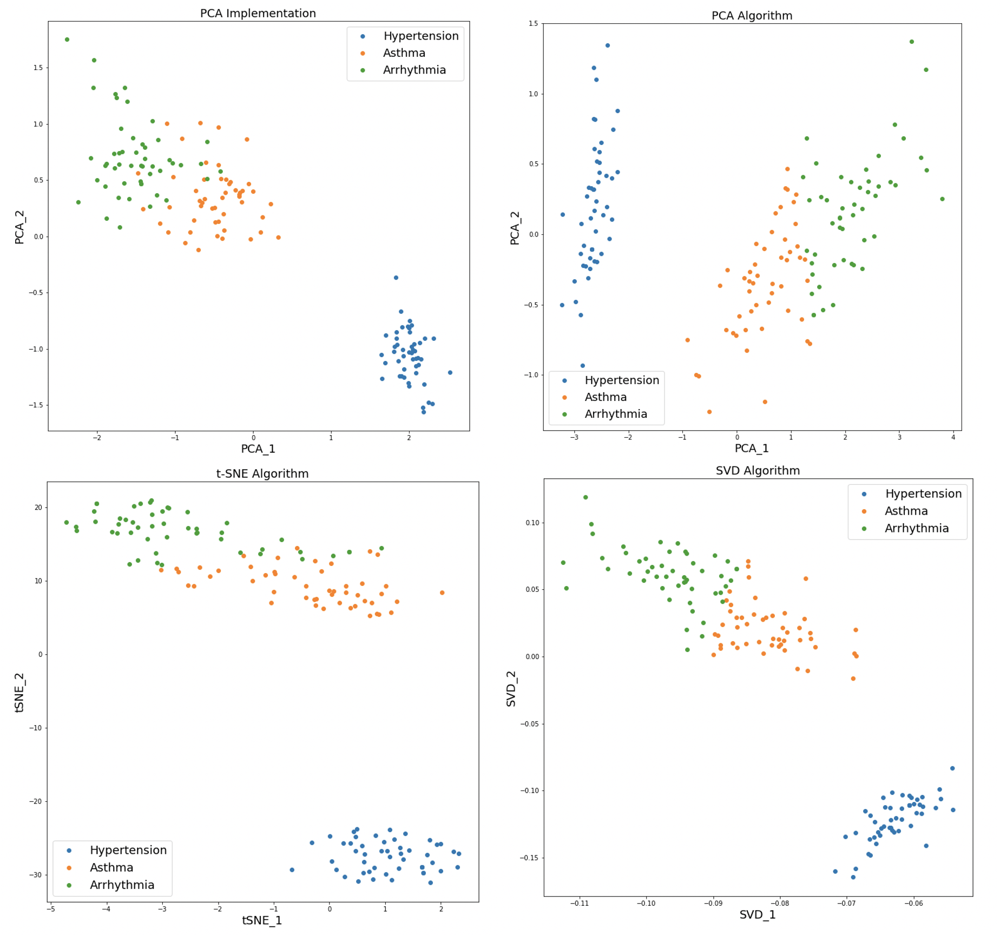
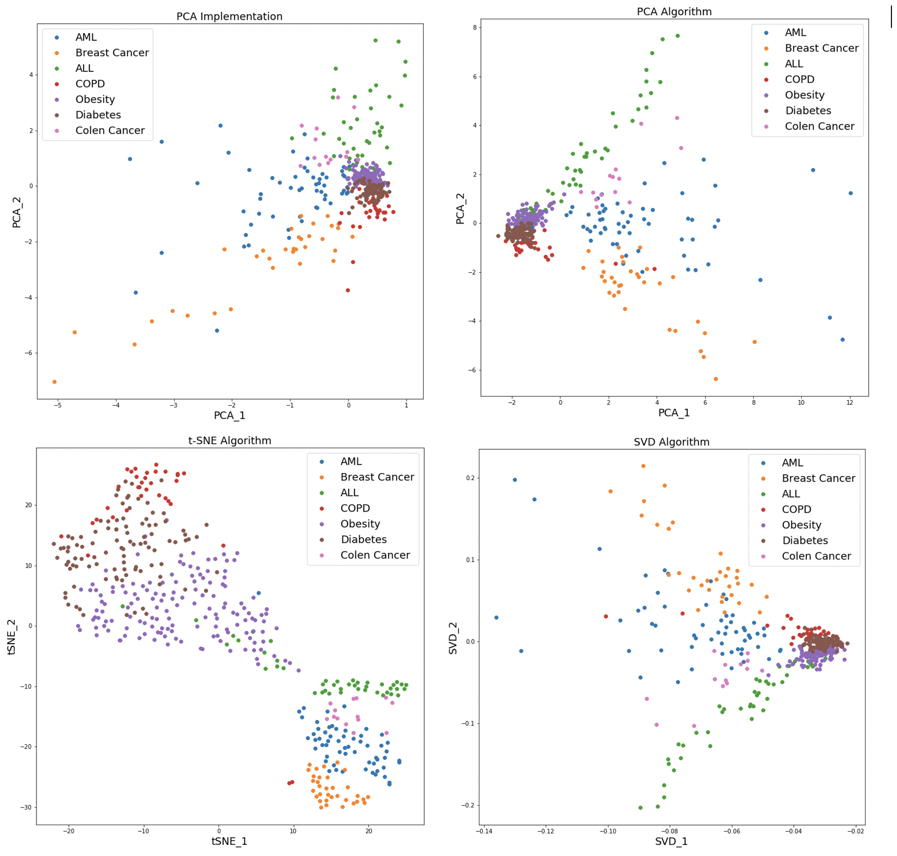

# Dimensionality Reduction: Principle Component Analysis Algorithm 

## Introduction

* *PCA is a linear dimensionality reduction algorithm which reduces the high dimensional correlated data into a low dimensional uncorrelated data.*
* *The new dimensions formed from PCA are called Principal Components and they are orthogonal to each other.*
* *The Principal Components formed by the PCA explains the maximum variability in data.*

---

## Flow of PCA Implementation

1. Load the ‘pca_a.txt’/’pca_b.txt’/’pca_c.txt’ into the pandas data frame.
2. Drop the final column of the data frame since final column is the response variable of the dataset and store it in a variable for plotting purpose.
3. Transform the higher dimensions present in the data frame to the numpy array for matrix operation.
4. Calculate the mean value for each dimension of the numpy array and calculate the mean centered matrix by subtracting the original datapoints with the corresponding mean value of the dimension.
5. Transpose the mean centered matrix and use `numpy.cov()` to calculate the covariance of the transposed matrix.
6. Now calculate the eigen vectors and eigen values using `numpy.linalg.eig()` function.
7. Select the first 2 columns of the eigen vectors which gives the maximum variability of the original dataset.
8. Calculate the Principal components (Lower dimensional data) by multiplying the original data with the eigen vectors.
9. Finally merge the response column to the principal components dataframe.
10. Plot the scatter plots and color the data points based on the response value.

---

## Packages Used for PCA Implementation
* `numpy`
* `pandas`
* `matplotlib.pyplot`
* `sklearn.manifold`

---

## Data

* The data used to perform the PCA are pca_a.txt, pca_b.txt, pca_c.txt, pca_demo.txt are Biomedical data files where each row represents the record of a patient/sample.
* The last column is the disease name, and the remaining columns are features.

---

## Results

* The output of PCA scratch implementation is compared with the predefined PCA function and other dimentionality reduction algorithms like t-distributed Stochastic Neighbor Embedding (t-SNE) and Singular Value Decomposition (SVD).
* The output of all the four algorithms on the above mentioned data were plotted and the performance of the same were evealuated.

**Results of file pca_a.txt which contains Biomedical data of diseases like Hypertension, Asthma, Arrhythmia.**

**Results of file pca_b.txt which contains Biomedical data of diseases like Septic, TB, HVD, CA, CD.**

**Results of file pca_c.txt which contains Biomedical data of diseases like AML, Breast, Cancer, ALL, COPD, Obesity, Diabetes, Colen Cancer.**

---

## Inference 

1. From the scatter plots shown above we can see that graphs obtained from PCA and SVD algorithms are closely related to one another.
2. It is because both PCA and SVD compute Eigen values and Eigen Vectors for dimensionality reduction and removes the highly correlated columns in the high dimensional data.
3. The final dimensions obtained from PCD and SCA algorithms are uncorrelated and orthogonal in nature.
4. When mean centered data (normalized data) is given to the SVD algorithm, it gives similar plot as of PCA algorithm.
5. Both PCA and SVD can capture only the linear trend in data for dimensionality reduction, but t-SNE uses probabilistic approach to capture nonlinear trend in data as well.
6. Since t-SNE uses gradient descent algorithm, we get different plots each time we run the code.
---
